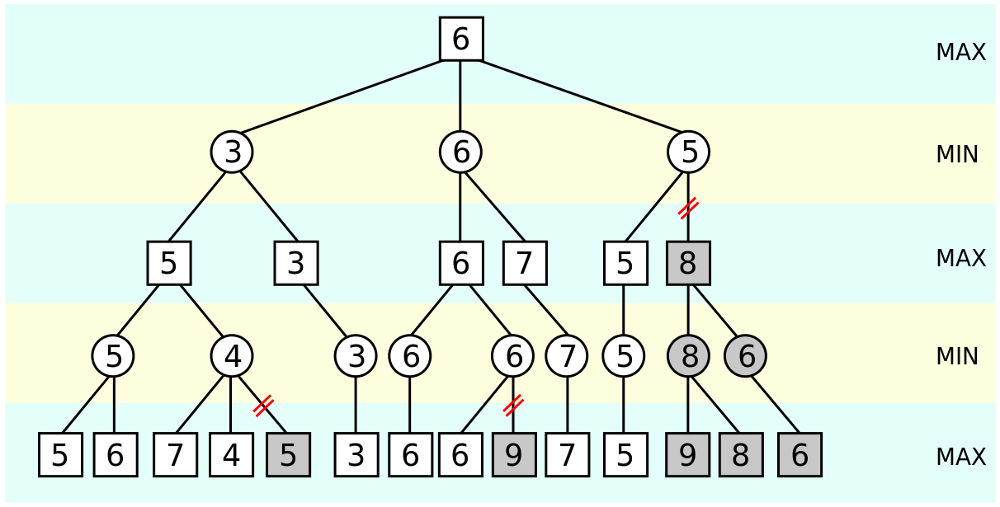

# 😎**五子棋工程*

------

**需求→设计→编码→测试→发布**

------

## 前言

五子棋AI是上大学第一学期做的第一个工程，其中断断续续做了近一个月时间，其中的思路和估值参考了许多这位大神的作品[lihongxun](https://github.com/lihongxun945/myblog/issues/11)，但其中有些算法功能还未能完全掌握运用，不过目前棋力很多时候已不输于其AI。由于没有掌握C++，而项目开始时过于自信，虽然程序中用了类，但实则为一个实实在在的C语言项目，可以直接忽略其中类的部分。就以后学习数据结构和算法前，此版为最终版，但此版中还存在着很多问题，其中最严重的就是由于拓展时建立了很多节点，当搜索广度为10，深度为时时，未经剪枝，则会创建约10^10个节点而每个节点都存有棋盘和下一步的点位棋盘，因此怀疑是内存消耗过多而导致程序意外退出，即使加入剪枝和内存清理也同样存在着闪退问题，暂未查明详细原因，待学习数据结构以后再深入探究重构。

### 我学到了什么

------

首先来说这是我独立完成的第一个包含GUI的完整的项目，学到了一种模块化的编程思想，先知道自己这个项目有什么需求，列清梳理好后再对函数进行设计，将各个功能区分开，最后再编码测试组装。其次是测试的重要性，这次项目中最头疼的无非就是找bug，当写好一串代码以后，不能运行或是不能安需求运行的概率很大，其中问题很可能就在一个数值的区别上，因此对更少的代码组织测试而不是等功能写好后在进行测试任意的多，具体的测试方法就不展开讨论，可以了解各种测试框架和最简单的利用print测试的方式。然后是代码的阅读能力有所提高，因为在学习是经常需要读懂别人的程序，尤其像java，js，python，对这些语言的语法和特点有了初步的认识。在一个是对算法尤其是博弈算法有了初步的了解，对Alphago有了更深的认识，就我目前的认知水平看来，机器眼里的世界是一个用代码表示的数学表示的世界，同样认识了许多崇拜的大佬。最后，**Talk is cheap, show me your code**.

### 这个AI的棋力如何

------

如果你对五子棋有一些研究，你是不那么容易被战胜的尤其是在你先手的时候。而若一个人并不是一个五子棋高玩就像我一样，通过和我还有身边以及网络上一些小伙伴的对战结果来看，这个AI已经能战胜绝大部分业余玩家。专业一点来说，根据棋力测试，目前我确定的AI的搜索深度是 `8` 层，广度为`6`，如果没有特殊的优化技巧，这个深度已经达到了一个比较高的水平但广度较低，这也是我程序本身的一大问题。

## 迭代

### 第一代

- **实现棋盘**
- **实现双人对战**

### **第二代**

- **评估每一个落子位置的分数，不参杂思维挖掘**

### **第三代**

- **蒙特卡洛搜索**（单例模式）

  **评估函数搜索全局，选择3个落点**

- ##### 选择


- ##### 拓展


- ##### 模拟

- ##### 回溯

### 第四代

- **更新蒙特卡洛搜索为全局模式**

- **新增Alpha-Beta剪枝**

### 第五代

- **重写启发式评估函数，提高运行速度**

## 实现


### 博弈算法

------

#### **深蓝**

从计算机问世后，博弈算法从来就没有停止过改进的步伐。最早打败人类顶级棋手的AI就是深蓝。以下内容摘自百度百科：

> 深蓝是美国IBM公司生产的一台超级国际象棋电脑，重1270公斤，有32个大脑（微处理器），每秒钟可以计算2亿步。"深蓝”输入了一百多年来优秀棋手的对局两百多万局。
> 1997年 6月，深蓝在世界超级电脑中排名第259位，计算能力为每秒113.8亿次浮点运算。
> 1997年的深蓝可搜寻及估计随后的12步棋，而一名人类象棋好手大约可估计随后的10步棋。每增加1步棋的搜寻能力约等于增加下棋强度约80 ELO分。

#### **博弈AI**

我的想法，博弈AI利用了现代计算机更加强大的算力，使得计算机能实现在某一功能上，对未来的评估能力和速度及细节上超过人类。目前，很多游戏都是"博弈"的，比如五子棋是双方博弈，斗地主也是。有些是双方竞争，有些会包含合作。在《人工智能-一种现代方法》一书中的第五章 《对抗搜索》中，介绍了博弈论专家们对博弈的一种定义：

> **有完备信息的，确定性的，轮流行动的，两个游戏者的零和游戏**

这也是我们这套算法适用的场景，注意其中任何一个条件不满足，那么将无法直接使用这套算法进行设计。比如这些游戏就不行：

- 斗地主和德州等大部分牌类游戏，因为不是完备信息，看不到对方玩家的牌，而且还有随机性（摸牌不确定）
- 四国军棋，不是完备信息，不是双人游戏
- DOTA，不是完备信息，不是双人游戏，而且不是轮流行动

而五子棋，围棋，黑白棋，象棋等都是满足这些条件的，因此都可以用这套算法来实现。

#### **AI**

这里说一下自己对该AI比较狭义的看法。就我从头到尾编写的看法感觉他并不能称作一个AI，而只是一个按照规则执行的既定的程序，并没有学习的能力，即使这一次失败了，也不会在进行总结修改提升，而一切的修改提升都是编程人员测试完成的，进行的一切的模拟和判断都是靠对现实情景的数字化符号化完成的，和Alphago类AI有着很大的差别。

### 极小化极大值搜索

------

Minimax算法是一种递归算法，是一种消极的算法，他会假定对手的每一步都会走在对自己最有利的位置，也是一种深度优先的算法，他会先探索一个分支直至最底层，这也为Alpha-Beta剪枝提供了条件。

五子棋看起来有各种各样的走法，而实际上把每一步的走法展开，就是一颗巨大的博弈树。在这个树中，从根节点为0开始，奇数层表示电脑可能的走法，偶数层表示玩家可能的走法。在全局搜索的情况下，算法将对棋面中的每一个点位进行延申，他将对未来规定深度和运行时间下的每一种可能进行模拟，拓展，对每一个最终节点进行评估，也就是后面的局势评估函数，我们规定对电脑越有利，分数越大，对玩家越有利，分数越小，分数的起点是0。最后进行回溯，由于对落点的选取根据的是末节点的局势，因此Minimax的性能很大取决于局势评估函数的准确性。

在拓展的层中，区别为Min层和Max层。

- 电脑走棋的层我们称为 MAX层，这一层电脑要保证自己利益最大化，那么就需要选分最高的节点。
- 玩家走棋的层我们称为MIN层，这一层玩家要保证自己的利益最大化，那么就会选分最低的节点。

下面是wiki上Minimax算法的一张图


回溯时，节点将对本节点和上一级节点的值进行比较，若本节点为上一级的第一节点，则将上一节点的分数与本节点同步，否则将比较两者分数的大小，在Max节点，则将取两者中的最大值，同理，Min选取最小值。若本节点是上一节点选择的最后一个，则在比较后对上一级节点回溯。

最后是wiki上的Minimax算法的伪代码，我的Minimax函数基本上是基于对该伪代码的实现

```c
function  minimax( node, depth, maximizingPlayer ) is
    if depth = 0 or node is a terminal node then
        return the heuristic value of node
    if maximizingPlayer then
        value := −∞
        for each child of node do
            value := max( value, minimax( child, depth − 1, FALSE ) )
        return value
    else (* minimizing player *)
        value := +∞
        for each child of node do
            value := min( value, minimax( child, depth − 1, TRUE ) )
        return value
```

#### 在我的代码中

##### **节点对应结构**

```c
struct Node_Tree{
        int flag,cnt,depth,result=0,number=0,Alpha=-100000000,Beta=+100000000;
        int VmBoard[16][16];
        struct Node_Tree* son[216];
        COORD site[216];
        Node_Tree *Last;
    };
```

fiag储存棋子，cnt储存下一层节点的探索的索引，depth储存深度，resulte储存节点棋盘是否已有胜负，number储存下一层总节点数量，Alpha和Beta储存当前节点的最大最小值用以剪枝，VmBoard\[16][16]储存模拟棋盘，struct Node_Tree* son[216]储存下一节点的指针，COORD site[216]储存下一层节点的落子点，Node_Tree *Last指向上一节点。

##### **创建根节点**

```c
Node_Tree* createroot();
```

创建树的根节点，通过启发式评估函数选择下一层的点位，储存回溯得到的最大值和位置

##### 创建叶节点

```c
Node_Tree* createleaf();
```

和创建根节点类似

##### 节点的延申

```c
Node_Tree* createlist();
```

当当前的depth<deep和未有棋子连五时通过createleaf()函数进行延申

##### Minimax的实现

```c
void Minimax (createlist(createroot()))；
```

当depth!=0时对每一个节点与上一级节点比较并在符合min或max层条件时赋值，对createlist()得到的根节点再次进行Minimax处理

### Alpha-Beta 剪枝

------

From wiki ：Alpha–beta 修剪是一种搜索算法，旨在减少其[搜索树](https://en.wikipedia.org/wiki/Game_tree)中[最小最大值算法](https://en.wikipedia.org/wiki/Minimax#Minimax_algorithm_with_alternate_moves)评估的节点数。它是一种对抗性搜索算法，通常用于双人游戏（[井字游戏](https://en.wikipedia.org/wiki/Tic-tac-toe)、[国际象棋](https://en.wikipedia.org/wiki/Chess)、[连接 4](https://en.wikipedia.org/wiki/Connect_4) 等）的机器游戏。当发现至少一种可能性证明该移动比先前检查的移动更糟糕时，它会停止评估移动，这些举措无需进一步评估，他会修剪掉不可能影响最终决策的分支。

##### 剪枝是必须的

上一篇讲了极小化极大值搜索，其实单纯的极小化极大值搜索算法并没有实际意义。

可以做一个简单的计算，平均一步考虑 50 种可能性的话，思考到第四层，那么搜索的节点数就是 `50^4 = 6250000`，在我的酷睿I7的电脑上一秒钟能计算的节点不超过 5W 个，那么 625W 个节点需要的时间在 100 秒以上。电脑一步思考 100秒肯定是不能接受的，实际上最好一步能控制在 5 秒 以内。

顺便说一下层数的问题，首先思考层数必须是偶数。因为奇数节点是AI，偶数节点是玩家，如果AI下一个子不考虑玩家防守一下，那么这个估分明显是有问题的。
然后，至少需要进行4层思考，如果连4四层都考虑不到，那就是只看眼前利益，那么棋力会非常非常弱。 如果能进行6层思考基本可以达到对战普通玩家有较高胜率的水平了（普通玩家是指没有专门研究过五子棋的玩家，棋力大约是4层的水平），如果能达到8层或以上的搜索，对普通玩家就有碾压的优势，可以做到90%以上胜率。

下面是wiki上Alpha-Beta剪枝的一张图


##### 核心思想

该算法维护两个值，alpha 和 beta，分别表示最大化玩家确信的最低分数和最小化玩家确保的最高分数。最初，alpha 是负无穷大，beta 是正无穷大，即两个玩家都从他们最差的分数开始。每当最小化玩家（即“测试版”玩家）保证的最高分数低于最大化玩家（即“阿尔法”玩家）保证的最低分数（即贝塔<阿尔法）时，最大化玩家不需要考虑该节点的进一步后代，因为它们在实际游戏中永远不会达到。

##### 剪枝实现

每个节点存有一个alpha 和 beta值，在回溯的过程中，会区分min层和max层更新对应的alpha 和 beta分数，当探寻下一个枝节点时，会将上一级节点已有的alpha 和 beta值传入，而当该节点被后续节点更新后，判断该节点的alpha 和 beta的大小，若Beta值小于等于Alpha值，则证明后续节点不会存在更优解，剪去不会对性能造成影响，因此可以直接回溯该节点。

```c
if (tmp->Beta<=tmp->Alpha)	Minimax(tmp);
```

这是我对Alpha-Beta剪枝的理解，下面是wiki给出的关于Alpha-Beta剪枝的伪代码

```c
function alphabeta(node, depth, α, β, maximizingPlayer) is
    if depth = 0 or node is a terminal node then
        return the heuristic value of node
    if maximizingPlayer then
        value := −∞
        for each child of node do
            value := max(value, alphabeta(child, depth − 1, α, β, FALSE))
            α := max(α, value)
            if value ≥ β then
                break (* β cutoff *)
        return value
    else
        value := +∞
        for each child of node do
            value := min(value, alphabeta(child, depth − 1, α, β, TRUE))
            β := min(β, value)
            if value ≤ α then
                break (* α cutoff *)
        return value
```

### 局势评估

------

局势评估是对末节点局势判断的根本函数，因此，该函数的好坏直接影响了整合Minimax函数的评估质量，也因此需要对于该函数做的比较仔细。

在这里我的处理方法是读取棋盘四个方向的所有行（斜向上舍去不能成5的几列），并储存为字符串，用find函数与预设情况进行匹配

```c++
string five[10] = {"22222", "1222211", "1122221"};//活五活四
string four[10] = {"022221", "122220", "22212", "22122", "21222"};//冲四
string three[10] = {"122211", "112221", "121221", "122121"};//活三
string LowRank[10] = {"022211", "112220", "022121", "121220", "021221", "122120", "1211221", "1221121", "1212121",
                      "0122210"};//眠三
string LiveTwo[10] = {"112211", "12121", "121121"};//活二
string SleepTwo[10] = {"022111", "111220", "021211", "112120", "021121", "121120", "21112"};//眠二
```

最后为避免盲目冲4等情况，对眠四的分数与眠四活三等数量进行相关，降低单独冲四的分数，减少单独冲四的发生

### **启发式评估函数**

------

通过我们对Alpha-Beta剪枝算法的理解，可以看到AB搜索的剪枝效率很大程度上取决于子节点的排序



上面可以看到在第二层中，第一个节点的值是3，第二个是6。因为3比较小，而这一层的最大值会被选中，所以第二个节点也需要完整计算所有孩子。如果3和6调换一下顺序，6在前，3在后。那么当第二个节点计算出第一个孩子5的时候就没有必要计算之后的孩子了。也就是，Alpha-Beta 剪枝的效率和节点排序有很大关系，如果最优的节点能排在前面，则能大幅提升剪枝效率。对于Max层节点同样适用。

那么如何排序呢？就是给所有待搜索的位置进行打分，按照分数的高低来排序。注意这个打分算法是对某一个空位进行打分，和对整个棋盘进行打分的 `Allscore()` 函数是不一样的。不过打分的基本原理是相同的。具体就是根据这个位置是否能成五，活四，活三等来进行打分。

有了打分之后，我们就可以按照分数高低进行排序了。具体实现的时候，是根据按照 成五，活四，双三，活三，其他 的顺序来排序的。

对于该函数在第四代中有一个重构，在此代之前，打分的方法和 `Allscore()` 函数类似，取空位周围米字形的8个方向从中间延申取4个点位，最后对得到的4个数组进行于 `Allscore()` 函数类似的匹配打分机制，得到每个节点的分数，但这样的AI即使在广度为3深度为8的情况下，运行时常也会达到近30s，而正常的速度应当小于5s为最佳，经过对printscore()函数的计时发现90%时间用在了这里，因此需要对该函数进行一次重构。

```c
void PrintScore();				//启发式搜索函数
```

重构后我们确定几个参数， empty, count, block, roable

empty对应相同棋子间的空位，count对应相同棋子的数量，block对应棋子两端与棋局边缘或不同颜色棋子相连的数量，roable对应四周可落子的数量

```c
int Myprint::ScoreGet(int empty,int count,int block,int roable)			//评分函数
```

首先要确定roable+count+empty>=5,必须满足这个条件才能使连五成为可能

其次对不同的empty，block，count进行分类讨论，具体实现可见代码ScoreGet()函数

由于不在进行复杂的匹配运算，只通过几个数值便可判断分数，虽然可能相比没有那么准确，但启发式评估函数毕竟需要计算的是全部节点，而Allscore()函数才是最终打分的关键，所以在尽量精确的情况下提高启发式搜索函数的速度才是首要的，经过重构，在广度为6，深度为8的情况下，运行时间依旧能保持小于5s

### 单元测试

------

本AI经过很多次测试，对局。主要对手为前文提及的github里的作者和手机app五子棋大师，而后为解决广度不够的问题，我们使第一层的搜索广度为棋盘上分数非零的位点，后续的7层广度为4，以尽可能解决深度过低或广度不够的问题。测试中，若设置广度为定值则容易出现走很多活三，眠四等问题，而广度过大则会出现深度不够或计算时间过久，因此分层计算不同的广度暂时为一个折中解决办法,充当一种类似于算杀的模块，但依旧受制于程序本身的问题


